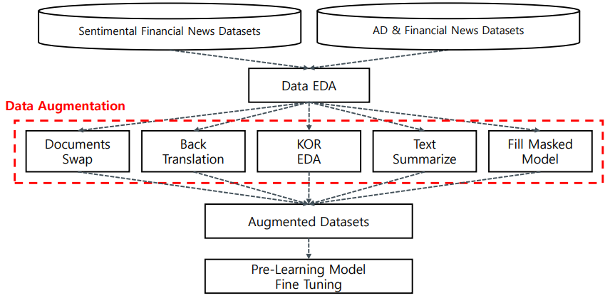
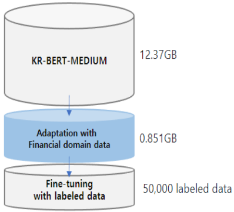
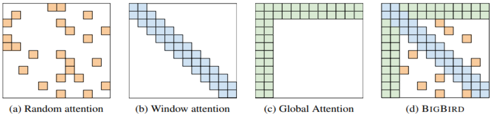
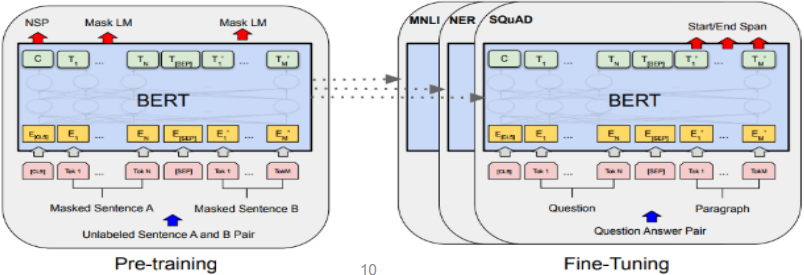
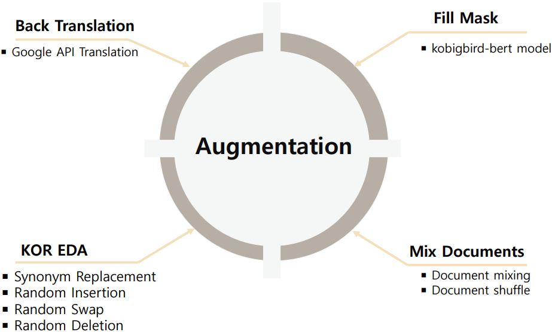

* 모두의 연구소 AIFFEL과 주식 시장에 관련된 데이터와 정보를 제공하는 회사인 FnGuide와 함께 진행한 프로젝트
* 데이터 EDA 및 시각화 자료는 저작권 및 보안상의 문제로 비공개 처리

 

## Team: FNpatch
 

|이름|역할|
|---|---|
|이승현|금융 뉴스 긍/부정 판별 Task 담당,Reference 조사,데이터 가공,Data Augmetation 구현,모델링,모델 훈련,결과 분석|
|박성우|광고/금융 뉴스 판별 Task 담당, Reference 조사,데이터 가공,Data Augmetation 구현,모델링,모델 훈련,결과 분석|

## 1. 프로젝트 개요
* 감성 분석을 통하여 해당 종목의 뉴스가 긍정인지 부정인지 판단해 최근 해당 종목의 감성이 긍정인지 부정인지 제공하기 위함
* Advertorial(협찬, 광고비 목적의 기사) 및 네이티브 광고(Native AD)뉴스를 분류해 보다 양질의 금융 뉴스를 제공하기 위함

## 목적: 국내 금융 뉴스에 대한 긍/부정 및 광고/금융 뉴스 분류 모델 개발

## 2. 데이터
FnGuide에서 자체 제작한 국내 주요 400여개 기업에 대한 label된 종목 뉴스 데이터

| Dataset | 분류 | 개수 | Label |
|---|:---:|:---:|:---:|
|긍/부정 뉴스|긍정|4800|1|
| |부정|3598|0|
|광고성 뉴스|광고|3200|1|
| |금융|2230|0|

* 주어진 데이터셋에는 긍정과 부정, 금융과 광고로 각각 이진 분류로 이루어진 데이터
* 각 데이터셋에는 __클래스 불균형이 존재__
* 뉴스 데이터의 레이블에 불균형이 존재하기 때문에 __다양한 데이터 증강기법에 초점을 맞춰 프로젝트를 진행하고자 함__

## 3. 프로젝트 프로세스

* 각 데이터에 대해 중복 제거 및 표준어 전처리 진행
* 논문과 깃허브를 참고하여 다양한 증강 기법 코드 구현
* 각 증강기법에 맞춰 데이터를 증강 시킨 후 모델 평가

## 4. Baseline Model 선정
### 4-1. snunlp/KR-FinBert

  

  

* Kobigbird-bert-base는 허깅페이스 사전학습 모델로 대부분의 모델들은 512 token이 최대 길이이지만, 해당 모델은 4096 token 길이까지 Input sequences를 받을 수 있음
* __뉴스의 경우 길이가 긴 문장이 많기 때문에 해당 모델이 적합할 것이라 판단__ 되어 베이스라인 모델 후보로 선정

### 4-3. klue/Roberta-base

  

* RoBERTa(Robustly Optimized BERT Pretraining Approach)는 BERT를 기반으로 만든 모델로써 NSP(Next Sentences Prediction)를 제거하고, 더 긴 Sequence로 더 긴 시간, 큰 배치로 학습을 시킨 모델
* 또한 동적 마스킹을 활용하여 Pretrained 시켜 여러 NLP Task에서 좋은 성능을 보이고 있는 모델이므로 베이스라인 모델 후보로 선정

### 4-4. Baseline Model 결과
#### 긍정 및 부정 뉴스
|Model|Accuracy|F1|
|---|---|---|
|__klue/roberta-base__|__98.37__|__0.99__|
|kobigbird-bert-base|97.52 |0.98|
|KR-FinBert |97.17|0.97|

#### 금융 및 광고 뉴스
|Model|Accuracy|F1|
|---|---|---|
|__klue/roberta-base__|__96.46__|__0.97__|
|kobigbird-bert-base|96.31|0.97|
|KR-FinBert |96.17|0.97|

* 두 데이터에서 모두 __klue/roberta-base의 성능이 가장 좋았기 때문에 baseline 모델로 선정__

## 5. Data Augmentation 기법

  

### 5-1. KOR_EDA Augmentation
* SR, RI, RS, RD의 4가지 기법을 사용하여 데이터 증강
* [사진 예시 넣기]

### 5-2. Mix Documents Augmentation
* kss 라이브러리를 통하여 문장을 분리한 후 2개의 뉴스 지문을 설정한 비율만큼 섞어서 새로운 뉴스 데이터 생성(Mix documents)
* 1개의 뉴스 지문내에서 문장을 설정한 비율만큼 랜덤하게 섞어서 새로운 뉴스 데이터 생성(Document Shuffle)
* [사진 예시 넣기]

### 5-3. Back Translation Augmentation
* 기존의 한국어 뉴스를 영어로 번역 후 다시 한국어로 재번역하는 방법
* 구글 번역 API를 사용하기 위해 googletrans 라이브러리 사용
* [사진 예시 넣기]

### 5-4. Fill Masked Model Augmentation
* 원문장의 임의의 토큰을 마스킹하고, MLM 방식으로 해당 마스크 문장을 예측하여 새로운 토큰을 생성해내는 방식
* 또한 [SEP], [PAD] 등과 같은 의미가 없는 토큰이 예측되지 않도록 코드로 구현
* 사전학습 모델은 긴 지문에 강점을 보이는 Kobigbird-base를 사용함
* [예시 넣기]
