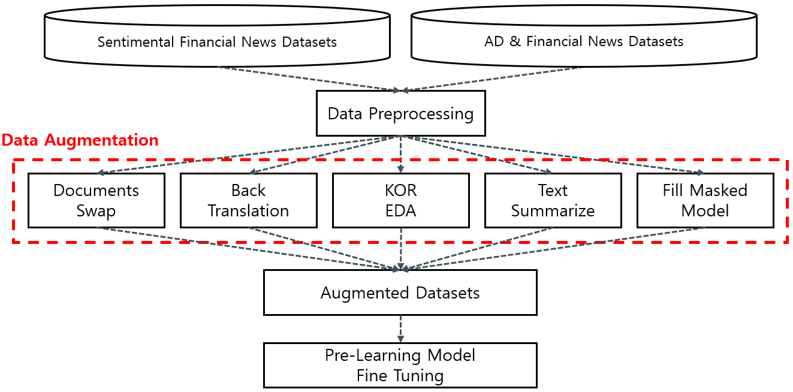

* 모두의 연구소 AIFFEL과 주식 시장에 관련된 데이터와 정보를 제공하는 회사인 FnGuide와 함께 진행한 프로젝트
* 데이터 EDA 및 시각화 자료는 저작권 및 보안상의 문제로 비공개 처리

 

## Team: FNpatch
 

|이름|역할|
|---|---|
|이승현|금융 뉴스 긍/부정 판별 Task 담당,Reference 조사,데이터 가공,Data Augmetation 구현,모델링,모델 훈련,결과 분석|
|박성우|광고/금융 뉴스 판별 Task 담당, Reference 조사,데이터 가공,Data Augmetation 구현,모델링,모델 훈련,결과 분석|

## 1. 프로젝트 개요
* 감성 분석을 통하여 해당 종목의 뉴스가 긍정인지 부정인지 판단해 최근 해당 종목의 감성이 긍정인지 부정인지 제공하기 위함
* Advertorial(협찬, 광고비 목적의 기사) 및 네이티브 광고(Native AD)뉴스를 분류해 보다 양질의 금융 뉴스를 제공하기 위함

## 목적: 국내 금융 뉴스에 대한 긍/부정 및 광고/금융 뉴스 분류 모델 개발

## 2. 데이터
FnGuide에서 자체 제작한 국내 주요 400여개 기업에 대한 label된 종목 뉴스 데이터

| Dataset | 분류 | 개수 | Label |
|---|:---:|:---:|:---:|
|긍/부정 뉴스|긍정|4800|1|
| |부정|3598|0|
|광고성 뉴스|광고|3200|1|
| |금융|2230|0|

* 주어진 데이터셋에는 긍정과 부정, 금융과 광고로 각각 이진 분류로 이루어진 데이터
* 각 데이터셋에는 __클래스 불균형이 존재__
* 뉴스 데이터의 레이블에 불균형이 존재하기 때문에 __다양한 데이터 증강기법에 초점을 맞춰 프로젝트를 진행하고자 함__

## 3. 프로젝트 프로세스

* 각 데이터에 대해 중복 제거 및 표준어 전처리 진행
* 논문과 깃허브를 참고하여 다양한 증강 기법 코드 구현
* 각 증강기법에 맞춰 데이터를 증강 시킨 후 모델 평가

## 4. Baseline Model 선정
### 4-1. snunlp/KR-FinBert

  

  

* Kobigbird-bert-base는 허깅페이스 사전학습 모델로 대부분의 모델들은 512 token이 최대 길이이지만, 해당 모델은 4096 token 길이까지 Input sequences를 받을 수 있음
* __뉴스의 경우 길이가 긴 문장이 많기 때문에 해당 모델이 적합할 것이라 판단__ 되어 베이스라인 모델 후보로 선정

### 4-3. klue/Roberta-base

  

* RoBERTa(Robustly Optimized BERT Pretraining Approach)는 BERT를 기반으로 만든 모델로써 NSP(Next Sentences Prediction)를 제거하고, 더 긴 Sequence로 더 긴 시간, 큰 배치로 학습을 시킨 모델
* 또한 동적 마스킹을 활용하여 Pretrained 시켜 여러 NLP Task에서 좋은 성능을 보이고 있는 모델이므로 베이스라인 모델 후보로 선정

### 4-4. Baseline Model 결과
#### 긍정 및 부정 뉴스
|Model|Accuracy|F1|
|---|---|---|
|__klue/roberta-base__|__98.37__|__0.99__|
|kobigbird-bert-base|97.52 |0.98|
|KR-FinBert |97.17|0.97|

#### 금융 및 광고 뉴스
|Model|Accuracy|F1|
|---|---|---|
|__klue/roberta-base__|__96.46__|__0.97__|
|kobigbird-bert-base|96.31|0.97|
|KR-FinBert |96.17|0.97|

* 두 데이터에서 모두 __klue/roberta-base의 성능이 가장 좋았기 때문에 baseline 모델로 선정__

## 5. Data Augmentation 기법

  

### 5-1. KOR_EDA Augmentation
* SR, RI, RS, RD의 4가지 기법을 사용하여 데이터 증강

|Method|Description|
|---|---|
|Sysnonym Replacement(SR)|Stop Words가 아닌 단어들 중에서 랜덤으로 선택해서 유의어 교체|
|Random Insertion(RI)|하나의 단어를 선택하고 그 단어의 유의어를 문장내의 임의의 위치에 삽입|
|Random Swap(RS)|랜덤으로 두개의 단어를 선택해서 위치를 바꿔줌|
|Random Deletion(RD)|P의 확률값을 가지고 문장 내의 각 단어를 제거|

### 5-2. Mix Documents Augmentation
* kss 라이브러리를 통하여 문장을 분리한 후 2개의 뉴스 지문을 설정한 비율만큼 섞어서 새로운 뉴스 데이터 생성(Mix documents)
* 1개의 뉴스 지문내에서 문장을 설정한 비율만큼 랜덤하게 섞어서 새로운 뉴스 데이터 생성(Document Shuffle)

### 5-3. Back Translation Augmentation
* 기존의 한국어 뉴스를 영어로 번역 후 다시 한국어로 재번역하는 방법
* ktextaug 패키지를 사용하여 구현

### 5-4. Fill Masked Model Augmentation
* 원문장의 임의의 토큰을 마스킹하고, MLM 방식으로 해당 마스크 문장을 예측하여 새로운 토큰을 생성해내는 방식
* 또한 [SEP], [PAD] 등과 같은 의미가 없는 토큰이 예측되지 않도록 코드로 구현
* 사전학습 모델은 긴 지문에 강점을 보이는 Kobigbird-base를 사용함

## 6. 1차 모델 테스트 결과
* 부족한 label인 __부정 데이터 1200개와 광고 데이터 1000개를 각각 증강__ 시킨 후 테스트 하였음

### 긍정 및 부정 뉴스
|Augmentation|Accuracy|
|---|---|
|baseline|98.37|
|Mix_Doc|97.71|
|Back_Trans|97.9|
|KOR_EDA|98.09|
|__Fill_Masked__|__98.47__|

### 금융 및 광고 뉴스
|Augmentation|Accuracy|
|---|---|
|baseline|96.31|
|Mix_Doc|96.32|
|Back_Trans|96.17|
|KOR_EDA|96.91|
|__Fill_Masked__|__97.49__|

## 7. 결과분석 및 문제 해결
### 7-1. Labeling Problem
#### 문제확인

* 긍정 및 부정 뉴스

|Document|수정 전 Label |수정 후 Label|
|---|---|---|
|SNT중공업(003570)은 연결기준 올해 1분기 영업이익이 29억4300만원으로 지난해 동기보다 20.0% 감소한 것으로 잠정 집계됐다고 29일 공시했다. 이 기간 매출은 703억600만원으로 4.2% 감소했다. 순이익은 544억6000만원으로 1521.8% 증가했다.|부정(0)|긍정(1)|

* 금융 및 광고 뉴스

|Document|수정 전 Label |수정 후 Label|
|---|---|---|
|넥센타이어는 독일 스포츠카 제조사인 포르쉐 '파나메라' 2세대 차량에 '엔페라 스포츠' 제품을 신차용 타이어를 공급한다. 넥센타이어 '엔페라 스포츠'는 유럽형 프리미엄 스포츠 타이어로 배수 성능이 우수하고 고속 주행에 적합한 제품이다. 이 타이어는 독일 '레드닷 디자인 어워드 2020'에서 제품 디자인 부문에서 상을 받았다.|금융(0)|광고(1)|

* 해당 데이터는 실제로 긍정(1)인 뉴스이고, 광고(1)인 뉴스이지만 __label이 잘못 맵핑되어 있다는 것을 확인__ 하였음

#### 해결방법
* Train Data
  - 학습된 가중치 모델을 이용하여 Train Data를 Inference 후 모델별로 틀린 데이터 확인 후 label 변경(softmax 확률값 확인)
* Validation, Test Dataset
  - 데이터 전수 조사 후 label 변경

#### 결과

* 긍정 및 부정 뉴스

||수정 전|수정 후|
|---|---|---|
|Positive|4800|__4789__|
|Negative|3598|__3562__|
|total|8398|__8351__|

* 금융 및 광고 뉴스

||수정 전|수정 후|
|---|---|---|
|Finance|3200|__3176__|
|AD|2230|__2235__|
|total|5430|__5411__|

* 데이터의 문제는 협의하에 label을 교체하였으며, 이전의 실험 결과는 문제가 있는 데이터로 수행하였기 때문에 수정된 데이터로 다시 모든 실험을 진행함

### 7-2. Augmented Datasets Quality
#### 문제확인

|원문|KOR EDA 증강문|
|---|---|
|kb금융지주는 자회사인 kb증권의 2분기 연결기준 영업이익이 2036억 9900만 원으로 전년 동기 대비 11. 52% 감소했다고 22일 공시했다. 같은 기간 매출액은 1조 7590억 6200만 원으로 46. 44% 증가한 것으로 나타났다.|kb금융지주는 자회사인 kb증권의 2분기 __가업__ 연결기준 영업이익이 2036억 9900만 원으로 전년 동기 대비 __시간__ 11.52% 감소했다고 22일 공시했다. 같  __성인__ 은 기간 __백금__ 매출액은 1조 7590억 6200만 원으로 46. __문서__ 44% 증가한 것으로 __백금__ 나타났다.|

* 앞서 만든 여러가지 증강 기법을 적용하였을때 __생성된 증강문이 매끄럽지 않게 생성되는 문제를 확인__ 하였음

#### 해결방법
* 부족한 레이블 데이터를 추출하여 각각의 증강 기법을 적용하여 증강 데이터 생성
* 증강된 데이터에 Back translation기법을 적용하는 새로운 증강기법을 만들어냄
* 실험 전 후의 Perplexity(얼마나 말이 자연스러운지 나타내는 수치)값을 통하여 성능 비교

#### 결과
* Perplexity(PPL)를 통하여 생성된 문장 평가(언어 모델의 성능을 측정하는 평가 지표로 얼마나 말이 자연스러운지 나타내는 수치로 __값이 낮을수록 성능이 우수하다고 평가__)
  
|Aurgumentation Method|Raw + α|Raw + (α + Back traslation)|
|---|---|---|
|Mix Document|48.77|__36.02__|
|KoEDA|33.12|__26.84__|
|Fill mask|36.67|__29.13__|

### 7-3. 긴 뉴스에 대한 분류
#### 문제확인
* 모델의 Max_length를 넘어가는 길이의 뉴스를 잘 분류해내지 못하는 것을 확인하였음
* 본문에 있는 내용이 짤려 뉴스의 내용을 모두 전달하지 못한다는 문제점을 확인

#### 해결방법
* 512 토큰을 넘어가는 긴 뉴스에 대해 요약하는 방법을 사용함
* Gensim라이브러리를 이용한 추출적 요약 진행
* 위 결과를 바탕으로 요약문에도 앞 서 설명한 증강기법들을 적용하여 증강을 시키는 새로운 증강 기법을 만듦

## 8. 결과

* 긍정 및 부정 뉴스

|Rank|Augumentation|Accuracy|Negative F1|Positive F1|
|---|---|---|---|---|
|__1__|__Baseline__|__98.47__|__0.98__|__0.99__|
|2|Fill Masked |98.38|0.98|0.99|
|3|KOR EDA + Back Translation|98.19|0.98|0.98|
|4|KOR EDA|98|0.98|0.98|

* 금융 및 광고 뉴스

|Rank|Augumentation|Accuracy|Finance F1|AD F1|
|---|---|---|---|---|
|__1__|__Mix Documents__|__96.91__|__0.96__|__0.97__|
|__1__|__KOR EDA__|__96.91__|__0.96__|__0.97__|
|3|Summarize Sentence + Mix Documents|96.76|0.96|0.97|
|3|Summarize Sentence + KOR EDA|96.76|0.96|0.97|

* 긍정 및 부정 뉴스 Task에서는 모든 증강법이 baseline을 넘지 못하였음
* 하지만 금융 및 광고 뉴스 Task에서는 Mix Documents과 KOR EDA 증강법이 baseline의 성능보다 높은 것을 확인할 수 있었음

#### 추가적으로 Fngiude에서 자체적으로 개발한 모델과 비교하는 Task와 실제 데이터를 이용한 프로젝트 모델 평가에 대한 Task를 부여 받아 진행함

## 9-1. KF-DeBERTa 모델과 비교
* DeBERTa는 BERT 모델에서 Relative Positional Embedding(단어들의 간의 상대적인 위치 정보)를 사용하여 더 좋은 성능을 얻을 수 있다는 모델
* 긍정 및 부정 뉴스

|Rank|Augumentation|Accuracy|Negative F1|Positive F1|
|---|---|---|---|---|
|__1__|__Mix Documents + Back Translation__|__98.57__|__0.98__|__0.99__|
|2|Fill Masked |98.38|0.98|0.99|
|2|Back Translation|98.38|0.98|0.99|
|4|Summarize Sentence + Fill Masked|98.19|0.98|0.98|

* 금융 및 광고 뉴스

|Rank|Augumentation|Accuracy|Finance F1|AD F1|
|---|---|---|---|---|
|__1__|__Mix Documents + Back Translation__|__97.05__|__0.97__|__0.97__|
|2|Summarize Sentence + Back Translation|96.91|0.96|0.97|
|3|Mix Documents|96.76|0.96|0.97|
|3|Summarize Sentence + Mix Documents|96.76|0.96|0.97|

### 전체 결과 요약
* 긍정 및 부정 뉴스

|Rank|Model|Augumentation|Accuracy|Negative F1|Positive F1|
|---|---|---|---|---|---|
|__1__|__Kfdeberta-base__|__Mix Documents + Back Translation__|__98.57__|__0.98__|__0.99__|
|2|klue/Roberta-base|None|98.47|0.98|0.99|
|3|klue/Roberta-base|Fill Masked|98.38|0.98|0.99|
|3|kfdeberta-base|Fill Masked|98.38|0.98|0.99|

* 금융 및 광고 뉴스

|Rank|Model|Augumentation|Accuracy|Negative F1|Positive F1|
|---|---|---|---|---|---|
|__1__|__Kfdeberta-base__|__Mix Documents + Back Translation__|__97.05__|__0.97__|__0.97__|
|2|klue/Roberta-base|Mix Documents|96.91|0.96|0.97|
|2|klue/Roberta-base|KOR EDA|96.91|0.96|0.97|
|2|kfdeberta-base|Summarize Sentence + Back Translation|96.91|0.96|0.97|
